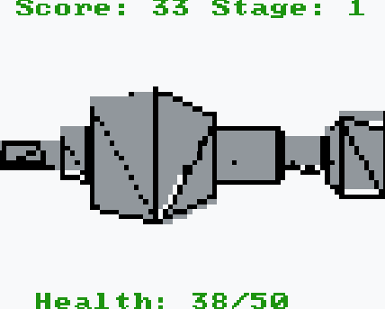

# ROOM

[ROOM is in the sprig gallery](https://sprig.hackclub.com/gallery/ROOM).
(Woohoo!)
You can also find a [demo here](https://davnotdev.github.io/Room).

This is ROOM, a DOOM inspired 3D [pew pew]-er, built for the sprig, an amazing game console built by the folks at hack club.

In ROOM, your goal is to navigate a maze of walls, picking up med kits while your health slowly drains.
Evade and kill the spinning people.
Your score is determined by your survival time.
Good luck!

> Note that ROOM cannot run on a physical sprig due to hardware limitations!




```
//   ____    _____   _____
// /\  _`\ /\  __`\/\  __`\  /'\_/`\
// \ \ \L\ \ \ \/\ \ \ \/\ \/\      \
//  \ \ ,  /\ \ \ \ \ \ \ \ \ \ \__\ \
//   \ \ \\ \\ \ \_\ \ \ \_\ \ \ \_/\ \
//    \ \_\ \_\ \_____\ \_____\ \_\\ \_\
//     \/_/\/ /\/_____/\/_____/\/_/ \/_/
//
// /   w   [oooo]   i   \
// \ a s d [oooo] j k l /
//
// w = Forward      i = Pew Pew
// s = Go Left      j = Look Left
// d = Go Right     l = Look Right
// a = Backward     k = Look Behind
```

## Distribution

`sprig-dist.js` contains the code that goes straight into the sprig editor.
The rest of the code is made for the browser.
Though, sprig-ifying it is trivial.

## Code Structure

The sprig is not designed for 3D games.
In fact, this game goes against the spirit of sprig.
Sorry about that.
With that said, I'll summarize how ROOM works for those who plan on editing or reusing it.

### Game Logic

The game logic is implemented exactly how you'd expect it to be.
You can find it in `game.ts`.

### Graphics

ROOM has its own software rasterizer, found in `graphics.ts`.
Considering that the sprig only supports 16 colors, there is no interpolation meaning no fragment shaders.
The rendering API feels similar to those old fixed pipeline rendering APIs.
If you plan on editing this, I've put a note with things you should be aware of in the file.

### 3D Models

If you want to throw in your own 3D models, you will need to load them into vertices.
Within `load_obj.rs`, I have some Rust code that essentially does that.
(Sorry if you don't have a Rust installed, porting to another language isn't hard.)
Note that when exporting from blender, or whatever software of choice, export as a `.obj` and DISABLE EVERYTHING EXCEPT FOR VERTICES AND FACES.
This is very important because the renderer does not support fragment shaders like in modern graphics APIs do.

### Sounds

All sounds are generated in the sprig editor.
I recommend that you do the same.

